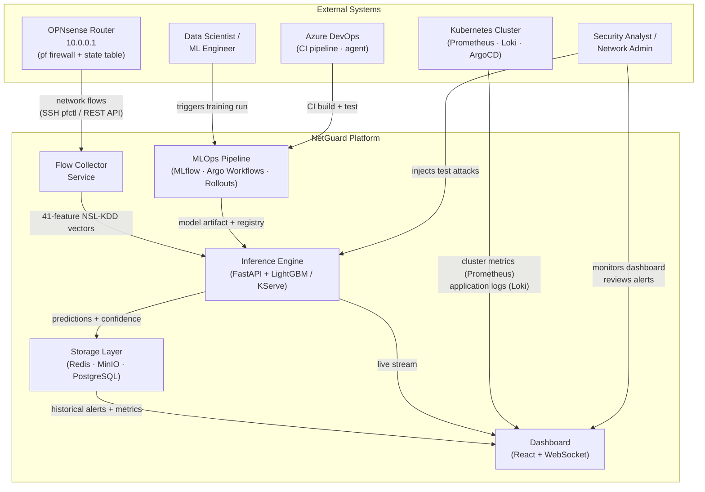

# NetGuard — System Context Analysis

## Problem Statement

Enterprise networks generate thousands of connections per second. Traditional rule-based IDS
(Snort, Suricata) detect known signatures but miss novel attack patterns. Machine learning
models trained on labeled flow datasets (NSL-KDD) can detect structural anomalies that have
no prior signature. However, deploying such models in production requires more than inference:
it requires a full lifecycle — data ingestion, feature engineering, model versioning, canary
deployment, drift monitoring, and observability.

**NetGuard** is a Kubernetes-native platform that closes this gap: it ingests real network
flows from the perimeter router, runs ML-based anomaly detection, and manages the entire
model lifecycle through GitOps and MLOps tooling.

---

## System Boundary

---

## Actors

| ID | Actor | Type | Description |
|----|-------|------|-------------|
| A1 | Security Analyst | Human (primary) | Monitors live detection feed, investigates flagged flows, validates model decisions |
| A2 | MLOps Engineer | Human (primary) | Triggers training, evaluates model versions, manages canary deployments and rollbacks |
| A3 | Network / Platform Admin | Human (secondary) | Monitors cluster health, manages ingress, configures OPNsense integration |
| A4 | OPNsense Router | External system | Source of all network flow data via pf state table |
| A5 | Kubernetes Cluster | External system | Provides infrastructure metrics (Prometheus) and structured logs (Loki) |
| A6 | CI/CD System (Azure + Argo) | External system | Triggers automated training and deployment pipelines |

---

## Quality Attributes (Non-Functional Requirements)

| Attribute | Requirement | Rationale |
|-----------|-------------|-----------|
| **Latency** | End-to-end flow → alert < 5 seconds | Actionable security response window |
| **Throughput** | ≥ 500 flows/second ingest | Realistic LAN traffic volume |
| **Availability** | Inference service 99.5% uptime | Security monitoring must be continuous |
| **Auditability** | All alerts persisted ≥ 30 days | Forensic investigation requirements |
| **Reproducibility** | Every model version fully logged | MLOps best practice — MLflow tracks all runs |
| **Safety** | Model updates via canary — never hard cutover | Prevents regression on production traffic |
| **Observability** | Latency p50/p95, drift indicators, accuracy tracked | Detect silent model degradation |
| **Portability** | All components containerised, K8s manifests | Deployable on any conformant cluster |
