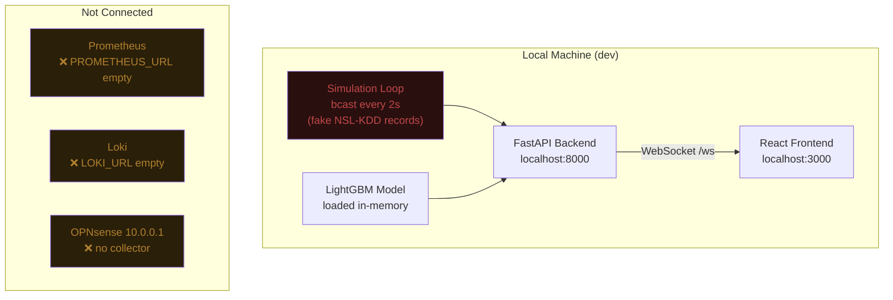
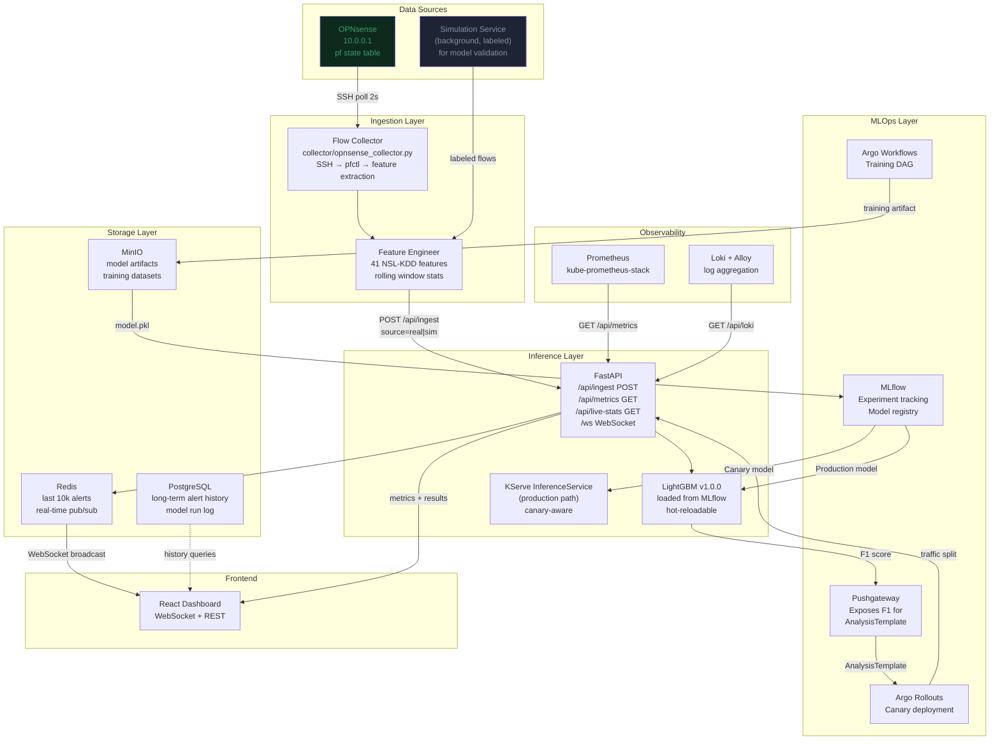
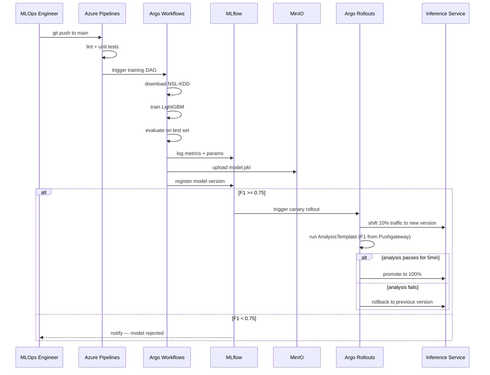
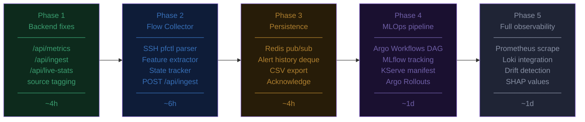

# NetGuard — Architecture Design

## Current Architecture (As-Is)



**Problems with this:**
- All data is synthetic — model runs on fake flows
- No persistence — restart loses everything
- `/api/metrics` returns 422 (missing query param)
- Cluster Status and MetricsPanel are broken
- `true_label` is generated but never used for live accuracy
- Model loaded once at startup, no hot-reload or versioning

---

## Target Architecture (To-Be)



---

## Component Specifications

### 1. Flow Collector (`collector/opnsense_collector.py`)

**Responsibility:** Bridge OPNsense pf state table → NSL-KDD feature vectors

```
Input:  pfctl -s states -v  (SSH, every 2s)
Output: POST /api/ingest    (JSON, 41 features + metadata)
```

**Feature extraction logic:**

| NSL-KDD Feature | Source |
|----------------|--------|
| `protocol_type` | pf state proto field |
| `service` | dst_port → service map (80→http, 22→ssh…) |
| `flag` | pf TCP state → SF/S0/REJ/RSTO |
| `src_bytes` | pf state byte counter (from -v) |
| `dst_bytes` | pf state byte counter |
| `duration` | pf state age field |
| `count` | connections to same dst in last 2s (rolling window) |
| `srv_count` | connections to same service in last 2s |
| `serror_rate` | fraction SYN-error states in last 2s |
| `dst_host_count` | connections to same dst in last 100 flows |
| `dst_host_srv_count` | same service + same dst in last 100 |
| All others | Conservative defaults (0) |

**State tracking:**
- `seen_keys: set` — deduplication across polls (key = proto+src+dst+ports)
- `recent_window: deque(maxlen=1000)` — rolling stats for statistical features
- Flush `seen_keys` every 60s to capture re-connections

---

### 2. Backend API — New/Fixed Endpoints

| Endpoint | Method | Status | Action |
|----------|--------|--------|--------|
| `/api/ingest` | POST | ❌ Missing | Accept raw flow dict → inference → broadcast → persist |
| `/api/metrics` | GET | ❌ Missing | Return `{cpu%, memory%, pod_count, node_count}` via psutil + kubectl |
| `/api/live-stats` | GET | ❌ Missing | Rolling precision/recall/F1 from simulated stream (ground truth available) |
| `/api/alerts` | GET | ❌ Missing | Query persisted alert history (time range, filters) |
| `/api/prometheus` | GET | ⚠️ Broken | Requires `query` param — frontend was calling with no params |

**Live accuracy tracking:**
```python
# Rolling window of (predicted, true_binary) from simulated stream only
# Real flows: true_label = "unknown" → excluded from accuracy computation
accuracy_window = deque(maxlen=500)

# Metrics updated on every simulated prediction
def compute_live_stats():
    tp = sum(p==1 and t==1 for p,t in accuracy_window)
    fp = sum(p==1 and t==0 for p,t in accuracy_window)
    fn = sum(p==0 and t==1 for p,t in accuracy_window)
    tn = sum(p==0 and t==0 for p,t in accuracy_window)
    precision = tp / (tp + fp) if tp+fp > 0 else 0
    recall    = tp / (tp + fn) if tp+fn > 0 else 0
    f1        = 2*precision*recall / (precision+recall) if precision+recall > 0 else 0
    return {precision, recall, f1, accuracy=(tp+tn)/len(window)}
```

---

### 3. Storage Layer

**Phase 1 (current sprint):** In-memory only — extend to 10k alert deque
**Phase 2:** Redis for pub/sub and short-term history (TTL 24h)
**Phase 3:** PostgreSQL for long-term history, alert acknowledgement, user notes

Schema (Phase 3):
```sql
CREATE TABLE alerts (
    id          UUID PRIMARY KEY DEFAULT gen_random_uuid(),
    timestamp   TIMESTAMPTZ NOT NULL,
    src_ip      INET,
    dst_ip      INET,
    src_port    INTEGER,
    dst_port    INTEGER,
    protocol    TEXT,
    service     TEXT,
    prediction  INTEGER,     -- 0 or 1
    attack_type TEXT,
    confidence  NUMERIC(5,4),
    latency_ms  NUMERIC(8,2),
    source      TEXT,        -- 'real' | 'simulated' | 'injected'
    true_label  TEXT,        -- known only for simulated/injected
    status      TEXT DEFAULT 'open'  -- open | acknowledged | suppressed
);

CREATE INDEX ON alerts (timestamp DESC);
CREATE INDEX ON alerts (src_ip, timestamp DESC);
CREATE INDEX ON alerts (prediction, timestamp DESC);
```

---

### 4. MLOps Pipeline — Data Flow



---

## Build Order (Prioritised)



---

## Key Architecture Decisions

| Decision | Choice | Rationale |
|----------|--------|-----------|
| **Inference runtime** | FastAPI (dev) → KServe (prod) | FastAPI is fast to iterate; KServe gives canary, autoscaling, A/B |
| **Feature store** | None (stateless) | NSL-KDD features computed per-flow; no cross-flow features needed in real-time path |
| **Message queue** | None (Phase 1–3) → Redis Streams (Phase 4) | Direct HTTP is sufficient for 500 flows/s; queue needed only for burst buffering |
| **Model hot-reload** | Endpoint `/api/reload` | Avoids restart; new model loaded into memory atomically via Python threading.Lock |
| **Source tagging** | `source: real | simulated | injected` | Separates ground-truth stream (simulated) from unknown-truth stream (real) for accurate live metrics |
| **Accuracy computation** | Simulated stream only | Real OPNsense traffic has no ground truth; computing "accuracy" on it would be meaningless |
| **Canary gate** | F1 ≥ 0.75 for 5 min | Conservative threshold — network security prefers high precision over recall |
