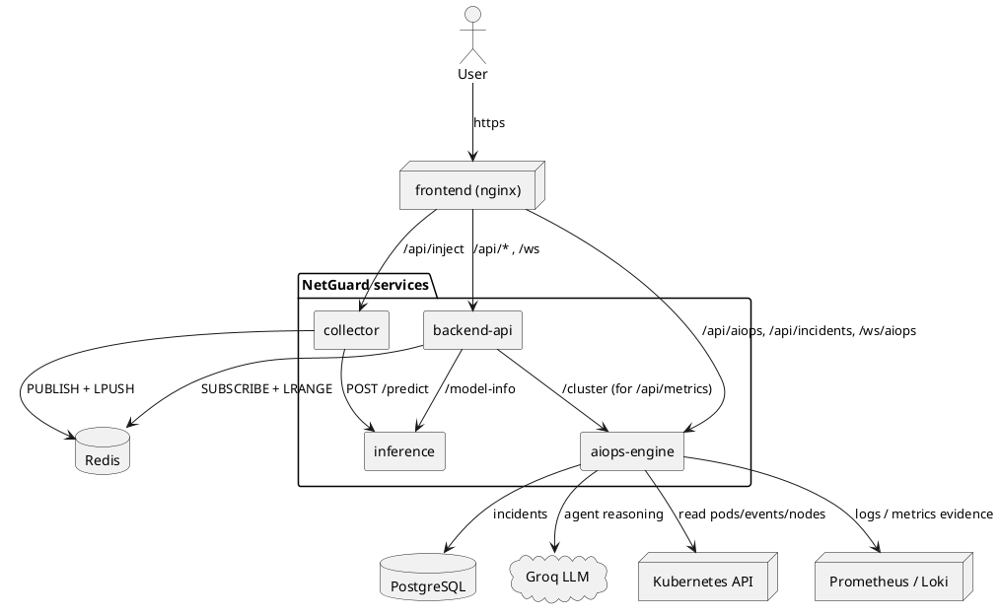
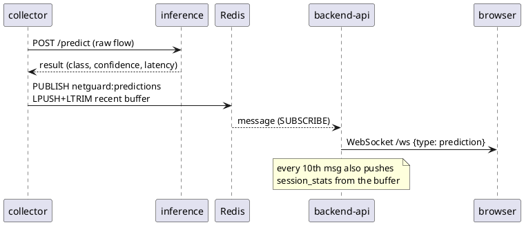
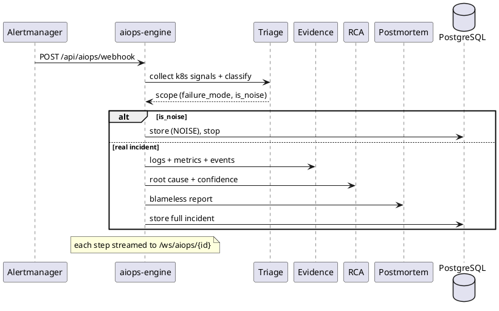

# NetGuard — Microservices Architecture

Status: current target architecture (supersedes the MLflow/KServe "to-be" in
`03-architecture.md`, which belonged to the dropped MLOps scope).

NetGuard is a network intrusion-detection demo application. Its job in this
project is to be a **realistic, signal-rich workload** that exercises the DevOps
platform end to end: per-service CI, GitOps delivery, progressive rollout,
observability, and AI-assisted recovery. The detection model is a swappable,
versioned artifact — the platform, not the dataset, is the contribution.

---

## 1. Why microservices

The original backend was a single FastAPI process mixing four concerns —
inference, traffic generation, the dashboard gateway, and the AIOps engine —
coupled through one in-process buffer. That is one deployable, one pipeline, one
blast radius. Splitting it yields independent build/test/deploy units, a real
"one pipeline per service" CI story, and a natural target for a canary rollout
(the inference service). The split is along the seams that already existed in the
code, so logic is **lifted, not rewritten**.

---

## 2. Service catalog

| Service | Responsibility | Stack | Public? |
|---|---|---|---|
| **frontend** | React dashboard + nginx edge router | React/Vite, nginx | yes (only entry) |
| **backend-api** | dashboard gateway: live `/ws`, metrics, live-stats, Prom/Loki proxies | FastAPI, Redis, psutil | via nginx |
| **inference** | LightGBM scoring (`/predict`, `/model-info`) | FastAPI, LightGBM | internal |
| **collector** | NSL-KDD replay / synthetic gen / attack injection | FastAPI, httpx | internal |
| **aiops-engine** | incident pipeline (Triage→Evidence→RCA→Postmortem), owns all k8s reads | FastAPI, LangChain+Groq, k8s | via nginx |

| Datastore | Role |
|---|---|
| **Redis** | live prediction pub/sub (`netguard:predictions`) + capped history list |
| **PostgreSQL** | incident history (in-memory fallback when `AIOPS_DB_URL` is empty) |

---

## 3. Component view



**Excalidraw prompt** (paste into an Excalidraw AI "text-to-diagram", or use the
Mermaid→Excalidraw import): *"A left-to-right cloud architecture diagram. A user
connects to a single 'frontend (nginx)' box. nginx fans out to three boxes:
'backend-api', 'collector', and 'aiops-engine'. 'collector' arrows to
'inference' and to a 'Redis' cylinder. 'backend-api' arrows to 'Redis' and to
'inference'. 'aiops-engine' arrows to a 'PostgreSQL' cylinder, a 'Groq LLM'
cloud, a 'Kubernetes API' box, and a 'Prometheus/Loki' box. Group the five
service boxes in a rounded container labelled 'NetGuard'. Use a calm blue/teal
palette, rounded rectangles, and straight arrows with labels like '/predict',
'PUBLISH', 'SUBSCRIBE'."*

---

## 4. Live detection data flow

The monolith's in-process buffer is replaced by Redis, fully decoupling the
producer (collector) from the consumer (backend-api).



`/api/inject` runs the identical path, so a demo-injected attack appears live
exactly like real traffic.

---

## 5. AIOps incident flow (current 4 agents)



**Planned evolution (deferred):** add **Remediation** (propose-only: emits the
declarative ArgoCD rollback/diff, a human applies) and **Verify** (re-triage to
confirm convergence), making it 6 agents and closing the loop:
*failure → signal → declarative reconciliation to a known-good state.*

---

## 6. Redis bus contract

| Key | Type | Producer | Consumer |
|---|---|---|---|
| `netguard:predictions` | pub/sub channel | collector `PUBLISH` | backend-api `SUBSCRIBE` → `/ws` |
| `netguard:predictions:recent` | list (cap 10k) | collector `LPUSH`+`LTRIM` | backend-api `LRANGE` for metrics/live-stats |

Payload: the JSON inference result (`prediction`, `is_attack`, `confidence`,
`class_probabilities`, `features{src_ip,…}`, `true_label`, `latency_ms`,
`timestamp`).

---

## 7. Public API surface & nginx routing

The React app calls only relative paths; nginx routes by longest-prefix match.

| Path | Routed to |
|---|---|
| `/api/aiops/*`, `/api/incidents*` | aiops-engine |
| `/ws/aiops/*` | aiops-engine (WebSocket) |
| `/api/inject` | collector |
| `/api/*` (status, metrics, cluster, live-stats, prometheus, loki) | backend-api |
| `/ws` | backend-api (WebSocket) |
| `/` | static SPA |

---

## 8. Configuration & secrets

Every service is configured by environment variables via `pydantic-settings`
(prefixes `INFERENCE_`, `COLLECTOR_`, `API_`; the lifted aiops package reads
`GROQ_API_KEY`, `GROQ_MODEL`, `PROMETHEUS_URL`, `LOKI_URL`, `AIOPS_DB_URL`).
Non-secret values have safe defaults; **secrets have no default**. Nothing
sensitive is committed — see `.env.example`. Containers run as a non-root user.

---

## 9. Local development

```bash
cp .env.example .env        # set GROQ_API_KEY for AIOps; rest works as-is
docker compose up --build   # redis + postgres + 5 services
# open http://localhost:8080
```

Each service is independently testable:

```bash
cd services/<name>
python -m venv .venv && .venv/bin/pip install -r requirements-dev.txt
.venv/bin/python -m pytest && .venv/bin/ruff check .
```

---

## 10. CI/CD (per service)

Each service is its own pipeline (matches the "one pipeline per microservice"
pattern, with the security/quality gates the reference lacks):

```
push → ruff (lint) → pytest → hadolint (Dockerfile)
     → docker build → Trivy (image CVE scan, fail on HIGH/CRITICAL)
     → push to ACR → ArgoCD sync
                    → inference also: Argo Rollouts canary (analysis on model F1)
```

See `.github/workflows/ci.yml`. Only services whose files changed are built
(path filters), keeping CI fast.

---

## 11. Testing strategy

Pure logic (scoring, metrics, generator, pipeline orchestration) is unit-tested
with injected fakes — no model artifact, Redis, Groq, or cluster needed. API
surfaces are tested with FastAPI `TestClient` and dependency overrides. Current
counts: inference 11, collector 7, backend-api 9, aiops-engine 7.
