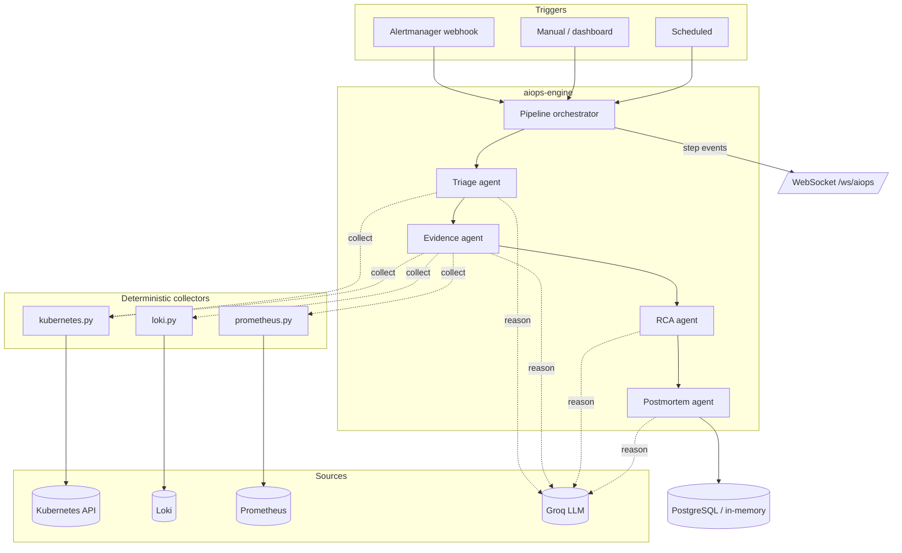
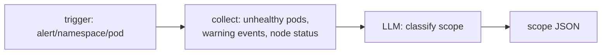
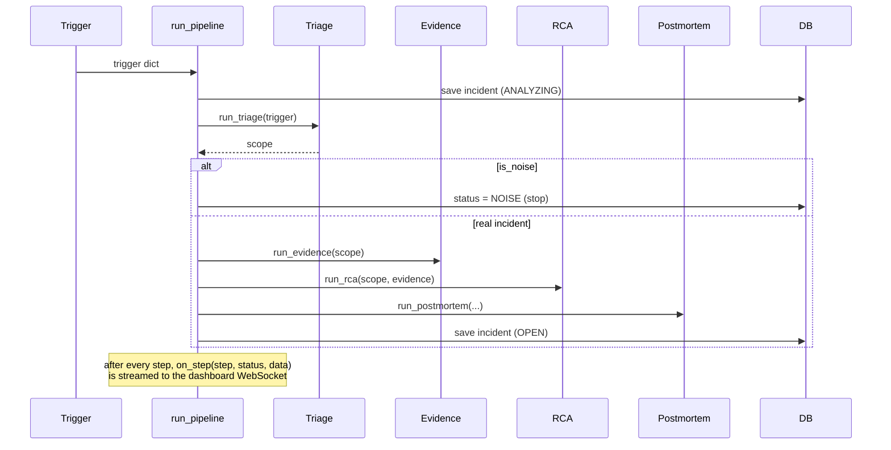
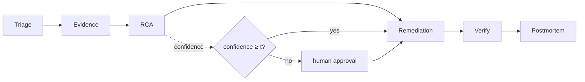

# NetGuard AIOps Platform — Technical Design

The `aiops-engine` service turns a Kubernetes failure into a structured, human-
readable incident: it collects the signals, reasons over them with an LLM, finds
the root cause with a confidence score, and writes a blameless postmortem with
prioritized actions — streaming each step to the dashboard in real time.

It is the concrete embodiment of the thesis statement: *every failure mode is
observable as a signal; every recovery is a declarative reconciliation from a
known-good state.* This document covers the first half (observe → diagnose) as
built, and the planned second half (reconcile) in §10.

---

## 1. Design principles (and why)

| Principle | What it means | Why |
|---|---|---|
| **Deterministic collectors, LLM only reasons** | Python gathers the signals with a fixed set of queries; the LLM is given the bundle and only classifies/reasons | The queries an SRE runs for a given failure are known in advance. Letting the LLM *select* tools (an agentic loop) cost ~13 LLM round-trips per incident, was slow on a free API tier, and was non-deterministic. Splitting "collect" (code) from "reason" (LLM) cut it to **4 calls**, made runs ~8 s, and removed a class of flakiness. |
| **One LLM call per agent** | Each agent is a single structured-output call, not a conversation | Predictable latency and cost; trivial to test (mock 4 functions). |
| **Raw evidence travels verbatim** | The collected logs/metrics are attached to the record unchanged, alongside the LLM summary | Downstream agents (RCA) reason over *real data*, not a lossy LLM paraphrase of it. |
| **Structured JSON contracts** | Every agent returns a fixed JSON schema (Groq JSON mode) | Reliable parsing, typed UI rendering, stable storage. |
| **Graceful degradation** | Every tool and agent has a try/except that returns a valid fallback object | One failed Loki query or LLM hiccup never crashes the pipeline; the incident still completes with what was available. |
| **Provider-swappable LLM** | A single factory builds the model client | Swap Groq → local Ollama (air-gapped) by editing one file; no agent code changes. |
| **Read-only + least privilege** | The engine only reads pods/events/nodes/deployments via a scoped ServiceAccount | Safe to run in-cluster; the diagnosis path can never mutate state. |

---

## 2. Architecture



Code layout (`services/aiops-engine/app/`):

```
main.py                 thin FastAPI: triggers, incidents API, /cluster, WS
aiops/
  pipeline.py           orchestrator (the 4-agent sequence + streaming)
  llm.py                Groq client factory
  db.py                 incident persistence (asyncpg or in-memory)
  agents/
    triage.py           what broke, where, how, is-this-noise
    evidence.py         logs + metrics + events for the affected pod
    rca.py              root cause + confidence (pure reasoning)
    postmortem.py       blameless postmortem + action items
  tools/
    kubernetes.py       pods/events/nodes/deploys (in-cluster client)
    loki.py             pod logs via Loki HTTP API
    prometheus.py       failure-mode-aware PromQL
```

---

## 3. The LLM layer — `llm.py`

A single factory builds the model. Every agent calls it; nothing else knows the
provider.

```python
from langchain_groq import ChatGroq

DEFAULT_MODEL = "openai/gpt-oss-120b"   # pinned; see note below

def get_llm(temperature: float = 0.0, json_mode: bool = True) -> ChatGroq:
    kwargs = {"model": os.getenv("GROQ_MODEL", DEFAULT_MODEL), "temperature": temperature}
    if json_mode:                       # force a JSON object response
        kwargs["model_kwargs"] = {"response_format": {"type": "json_object"}}
    return ChatGroq(**kwargs)
```

**Why Groq + `openai/gpt-oss-120b`.** The cluster has no GPU, so a local model
(Ollama) is too slow for an interactive dashboard — hence **hosted inference**.
Groq serves a current production model with very low latency, so a 4-call
pipeline finishes in ~8 s. `temperature=0` for the classification/reasoning
agents (determinism); `temperature=0.1` for the postmortem prose. The factory
keeps the provider swappable (e.g. a self-hosted `ChatOllama`), but that local
path trades away the interactive latency, so it is a **documented option, not
the evaluated configuration** — we do not claim air-gapped operation.

**Cloud-inference trade-off (owned, not hidden).** Evidence leaves the cluster
to a third-party LLM, so (a) the collector layer **redacts secrets** before it
does (§4), and (b) the model id is **pinned with a date**, because hosted models
churn — the previous default `llama-3.3-70b-versatile` deprecates 2026-08-16, so
it was repinned to `openai/gpt-oss-120b`. Reproducibility is bounded by the
hosted model's lifetime; the pinned string + date are recorded for that reason.

---

## 4. The collector layer — `tools/`

Each tool is plain Python that returns a JSON-able dict, with a mock fallback so
the platform runs (and demos) off-cluster.

**`kubernetes.py`** — uses the official client (`load_incluster_config` in-cluster,
else `load_kube_config`). `K8S_AVAILABLE` gates real vs mock:

```python
def list_unhealthy_pods(namespace=None) -> list[dict]:
    if not K8S_AVAILABLE:
        return _mock_unhealthy_pods()      # off-cluster demo scenario
    # ... return pods not Running/Succeeded, or Running pods whose containers
    #     are CrashLoopBackOff/OOMKilled/Error/ImagePullBackOff
```

It exposes `list_unhealthy_pods`, `get_k8s_events`, `get_node_status` (triage),
and `get_k8s_events_for_pod`, `describe_pod`, `get_recent_deployments` (evidence),
plus `get_cluster_summary` for the dashboard.

**`prometheus.py`** — the key idea is *failure-mode-aware* queries. Instead of one
generic query, a table maps each failure mode to the metrics that matter:

```python
FAILURE_QUERIES = {
  "OOMKilled":        {"memory_usage": '...container_memory_working_set_bytes...',
                       "memory_limit": '...kube_pod_container_resource_limits...'},
  "CrashLoopBackOff": {"restarts": '...', "cpu_usage": '...', "memory_usage": '...'},
  "Pending":          {"node_memory": '...', "node_cpu": '...', "pvc_bound": '...'},
  "default":          {"cpu_usage": '...', "memory_usage": '...', "restarts": '...'},
}
```

Each series is reduced to `min/max/latest/trend` (rising/falling/stable) so the
LLM gets a compact, decision-ready summary rather than thousands of raw points.

**`loki.py`** — pulls the last N log lines for the pod and separates out
error/warning lines by keyword, so the Evidence agent gets both the tail and the
errors. **Redaction (`redact.py`):** because logs are the highest-risk text and
they leave the cluster to the LLM, each line is scrubbed *here* — auth headers,
provider tokens, cloud keys, connection-string passwords, `key=value` secrets and
emails are replaced before the evidence is ever sent. IPs are kept (operationally
relevant to a network tool, not PII on their own). It is a best-effort,
documented control, not a guarantee.

---

## 5. The four agents

Each agent = *deterministic collect* → *one LLM reasoning call with a strict JSON
schema* → *parsed dict* (with a fallback on any exception).

### 5.1 Triage — *what broke, where, how, and is it noise?*



Collects the three fixed triage signals, then one call classifies:

```json
{ "affected_pods": ["..."], "affected_namespace": "...",
  "failure_mode": "OOMKilled|CrashLoopBackOff|Pending|Evicted|NodeNotReady|Unknown",
  "restart_count": 0, "first_failure_time": "...", "affected_node": "...",
  "severity": "HIGH|MED|LOW", "is_noise": false, "summary": "one sentence" }
```

`is_noise` is the **gate**: if Triage sees no failing pods it sets `is_noise=true`
and the pipeline stops — no wasted Evidence/RCA/Postmortem calls on a false alarm.
The prompt forbids inventing pod/node names ("base every field on the provided
signals").

### 5.2 Evidence — *gather corroborating signals for the affected pod*

Chooses the PromQL set by the failure mode from Triage, pulls Loki logs, pod
events, the pod's resource limits, and recent deployments. One call summarizes:

```json
{ "log_summary": "...", "last_log_line": "...", "error_lines": ["..."],
  "metric_findings": "...", "event_timeline": [...],
  "resource_limits": {"memory": "...", "cpu": "..."},
  "recent_deployment": true, "deployment_detail": "..." }
```

The **raw** logs/metrics/events are attached to the result as `raw_evidence`
(verbatim, not summarized) so RCA can cite real values.

### 5.3 RCA — *root cause + confidence* (no tools, pure reasoning)

Takes Triage + Evidence (raw evidence trimmed to keep the context small) and
reasons step by step:

```json
{ "reasoning_steps": ["1. symptoms...","2. metrics...","3. logs...",
                      "4. recent deploy?","5. probable cause","6. ruled out"],
  "root_cause": "one paragraph", "confidence": 0.0,
  "contributing_factors": ["..."], "ruled_out": ["..."],
  "severity": "HIGH|MED|LOW", "affected_components": ["..."] }
```

The **confidence** is a **rubric-anchored, self-reported** 0–1 — the prompt anchors
the scale (0.9–1.0 = a log line directly shows the cause; <0.5 = insufficient
evidence, flag it). It is deliberately **not** called *calibrated*: calibration is
an empirical property (do 0.9-confidence diagnoses turn out correct ~90% of the
time?) that requires a measured study (reliability diagram / ECE). Until that
exists, the confidence is a useful triage signal, but remediation stays
**propose-only with a human approver** — it is not used to gate autonomous changes
(§10).

### 5.4 Postmortem — *blameless report + action items*

One call (temperature 0.1) produces a Google-SRE-style blameless postmortem:

```json
{ "title": "...", "impact": "...", "timeline": [...], "root_cause": "...",
  "contributing_factors": ["..."], "what_went_well": ["..."],
  "action_items": [{"action":"...","priority":"P0|P1|P2","owner":"..."}],
  "lessons_learned": "...", "blameless_statement": "..." }
```

**Why a postmortem as the final step.** It converts the machine reasoning into the
artifact an on-call engineer actually wants, and the P0/P1/P2 action items are the
natural input to the future Remediation agent.

---

## 6. The orchestrator — `pipeline.py`



The orchestrator owns three things the agents don't: the **incident identity**
(`INC-YYYYMMDD-XXXXXX`), the **persistence** after each step (so a late-joining UI
sees partial progress), and the **`on_step` callback** that the API turns into
WebSocket messages for the live timeline. The noise short-circuit lives here.

---

## 7. Persistence — `db.py`

`asyncpg` to PostgreSQL when `AIOPS_DB_URL` is set, otherwise an in-memory dict
(local dev / demos). The JSON-bearing columns are **JSONB**, with an asyncpg codec
that encodes/decodes Python objects — the agents store dicts/lists directly and
reads come back parsed. JSONB (over TEXT blobs) is what makes the data
**queryable**: `WHERE (rca_output->>'confidence')::float > 0.8` for the evaluation,
and the SQL-similarity incident-memory plan (§10). `save_incident` upserts the full
record (timestamps coerced to `datetime` for the `TIMESTAMPTZ` columns);
`update_incident_step` patches one agent's column as the pipeline progresses;
`list_incidents` returns summary fields; `get_incident` the full record.

---

## 8. API & live streaming — `main.py`

| Endpoint | Purpose |
|---|---|
| `POST /api/aiops/analyze` | manual trigger (fire-and-forget task) |
| `POST /api/aiops/webhook` | Alertmanager receiver (Bearer-token auth) — one pipeline per alert |
| `GET /api/incidents` | list (table view) |
| `GET /api/incidents/{id}` | full record (detail view) |
| `PATCH /api/incidents/{id}/status` | resolve / suppress |
| `GET /cluster` | real node/pod snapshot (also used by backend-api) |
| `WS /ws/aiops/{id}` (or `__all__`) | live agent-step stream |

`run_pipeline` is launched as an `asyncio` task and its `on_step` callback
broadcasts `{type: "aiops_step", step, status, data}` to the matching WebSocket
subscribers, which is what drives the dashboard's animated 4-agent timeline. Every
incident and `/cluster` response carries a `data_source: live|mock` field so a
misconfigured deployment can never pass mock data off as real; degraded fallbacks
(from a transient failure) are flagged `degraded: true` rather than looking like a
clean result, and a failed collection becomes an **INCONCLUSIVE** incident, never
NOISE.

---

## 9. Evaluation

`tests/scenario_*.py` exercise the pipeline against representative failure modes
(OOMKilled, CrashLoopBackOff, Pending, missing-ConfigMap) with a common harness
in `tests/base.py` and a `run_evaluation.py` runner. Each scenario feeds a known
signal bundle and checks that Triage classifies the failure mode correctly and
RCA lands on the expected cause — a reproducible accuracy measure for the report.

Unit tests (`services/aiops-engine/tests/`) mock the four agent functions, so the
orchestration, the noise short-circuit, and the incident store are tested with no
Groq/cluster dependency.

---

## 10. How to improve it (roadmap)

The platform today **diagnoses**; the thesis also promises **recovery**. The
highest-value next step closes that loop.



1. **Remediation agent (propose-only first).** From the RCA, emit a *declarative*
   fix — the exact `argocd app rollback` / sync / scale, with the diff — never an
   imperative `kubectl` hack. This is the thesis sentence executed: reconcile to a
   known-good state. Start propose-only (a human clicks apply) for a safe demo,
   then gate auto-apply on confidence.
2. **Verify agent.** After a fix is applied, re-run Triage and confirm the system
   converged to healthy (or escalate). This proves *reconciliation*, not just a
   one-shot action — the demo's money shot.
3. **Confidence-gated autonomy (only after a calibration study).** Use the RCA
   `confidence`: high → auto-remediate; low → human-in-the-loop. This first
   requires **measuring calibration** (reliability diagram / ECE over many runs) —
   gating live cluster changes on an unvalidated self-reported number is unsafe,
   so until then remediation stays propose-only with a human approver.
4. **Incident memory.** Have RCA retrieve similar past incidents from the Postgres
   store (keyword/SQL similarity — no vector DB needed) so it can cite precedent
   and improve over time. Turns the postmortem store into a learning loop.
5. **Event-driven triggering.** Wire the Alertmanager webhook end-to-end so a real
   alert (not a manual click) starts the pipeline — "every failure is a signal."
6. **Agent observability.** Record per-incident token usage, latency, and cost so
   the AIOps layer is itself measurable in Prometheus/Grafana.

Safety note for the demo: remediation only ever targets NetGuard's own namespace
via a bounded, reversible ArgoCD action, so the blast radius is a namespace you
control — never the platform.
